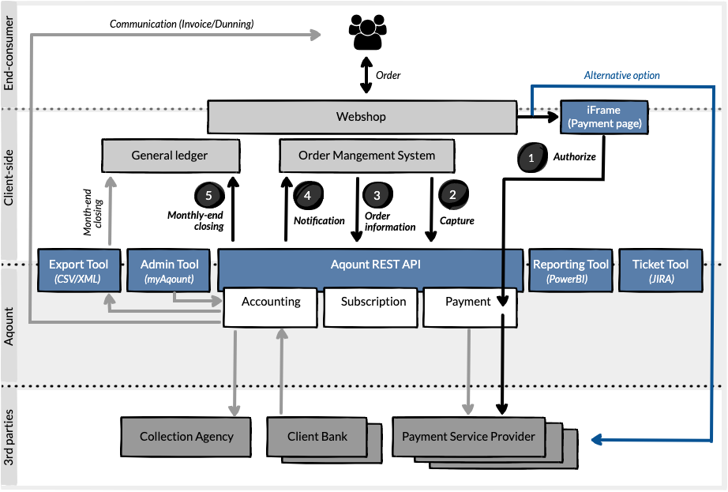

> An overview of our flagship product and its capabilities.

The Aquont Webshop is our main product and as such is the foundation of our Aqount-based service delivery. The product can be used in a number of ways. Almost all of the features offered by the Aqount Webshop are considered optional, which meets our demand for high flexibility and customizability and allows you to use the product according to your needs.

Whether it is about payments, order management or accounting, Aqount Webshop serves to orchestrate and integrate with the various components and service providers in the related ecosystem. The typcial environment looks like: 

## High-level overview of Aqount Webshop and the typical environment

## Use cases

### :fa-lock: Payment authorisation

Authorisation is the fundamental pre-condition to online accept payments via your webshop. Aquont Webshop provides multiple options to manage authorisation depending on your situation, setup and needs.

> **Sample Option A:** Authorisation via our "Payment page": 
We serve as One-Shop-Stop and deal with all communication and integration with the [Payment Service Provider (PSP)](/glossary#psp-payment-service-provider) of your choice. Using our highly customisable API component "Payment page" allows you to easily integrate your webshop with our API to manage all authorisation-relevant business logic in the context of all your payments. 

> **Sample Option B:** Direct PSP authorisation: 
You already have your PSP integration in place or prefer to have a direct connection to the PSP of your choice. Our payment process integrates with your direct authorisation seamlessly. 

### :fa-money: Capture

### :fa-shopping-basket: Retrieve and store relevant order information

### :fa-bell-o: Retrieve and store relevant order information

### :fa-calendar-o: Handle monthly-end closing

